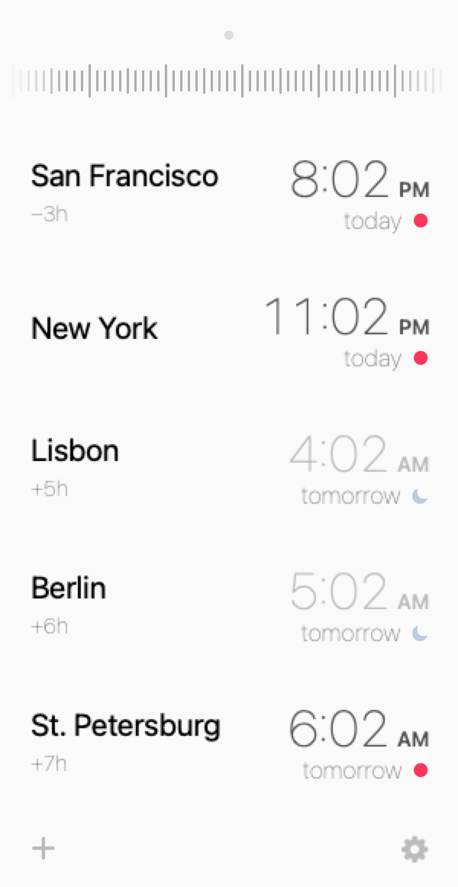

# TZC

The time-zone converter I wanted to keep using.

TZC is a native Apple-silicon clone—and a small improvement—of the original
[Time Zone Converter](https://timezoneconverterapp.com). That app was abandoned
and was starting to break on the latest macOS releases, so I rebuilt it in Swift.

It lives in the menu bar. Drag the ruler to compare cities, reorder them directly,
or open the calendar for a specific date. No Electron. No Rosetta. No Dock icon.



## Main features

- One draggable timeline across every city, with 15-minute precision
- Fast city search and direct drag-to-reorder
- Calendar mode with accurate daylight-saving changes
- 12/24-hour time, availability indicators, and three themes
- Native Apple-silicon menu-bar app with automatic Start at Login

## Install

Download the [latest release](https://github.com/artignatev/TZC/releases/latest),
move `TZC.app` to Applications, and open it once.

Requires Apple silicon and macOS 14 or later.
The current build is not notarized, so use right-click → Open on first launch.

## Build it

```sh
swift test
./Scripts/package-app.sh
```
